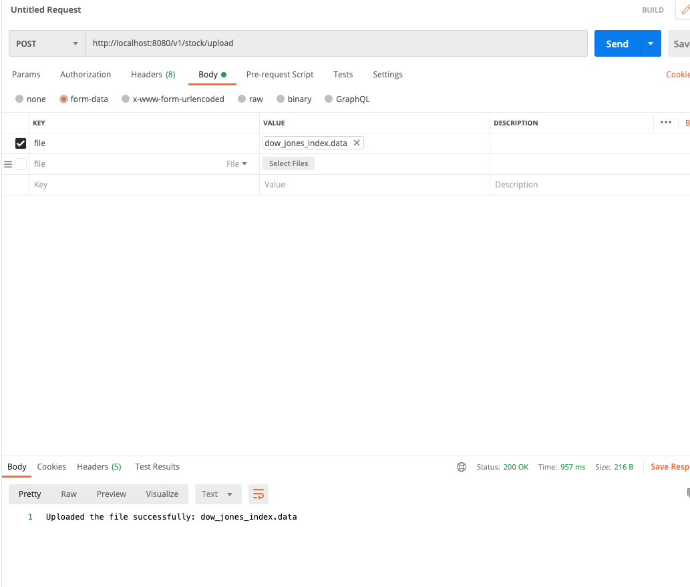

# stock with postgres
demo stock market spring async service call

## Requirements
* Java 8
* Apache Maven 3.5.0 or higher
* Docker install
* Postgres

## Using docker first solution recommend more easy

- Build the project  
```
mvn clean install -Dspring.profiles.active=test

or

mvn clean install -DskipTests
```
- Run using docker-compose
```
docker-compose up --build 
```


## How to Run Second solution

- Clone the project
- installing postgres in your local machine
- Build the project  
- change in application-dev for postgres config locally
```
mvn clean install -Dspring.profiles.active=test

or

mvn clean install -DskipTests
```
- Run the application
```
java -jar target/urlshortener-service-0.0.1-SNAPSHOT.jar
```
- Make sure your postgres is up

## HOW to test

(the dataset is in resources folder for upload purpose)
- you need postman install 
- or you can use swagger http://localhost:8080/swagger-ui/index.html and make request base on postman example
(you cannot test the upload file with swagger)
GET STOCK BY TICKET AND QUARTER


UPLOAD



INSERT NEW DATA

